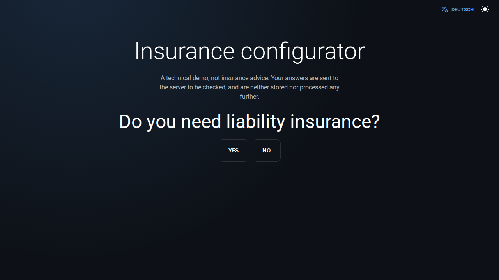
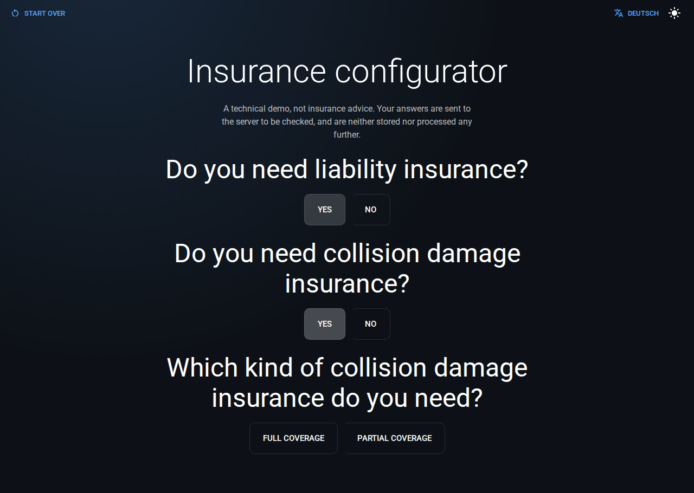
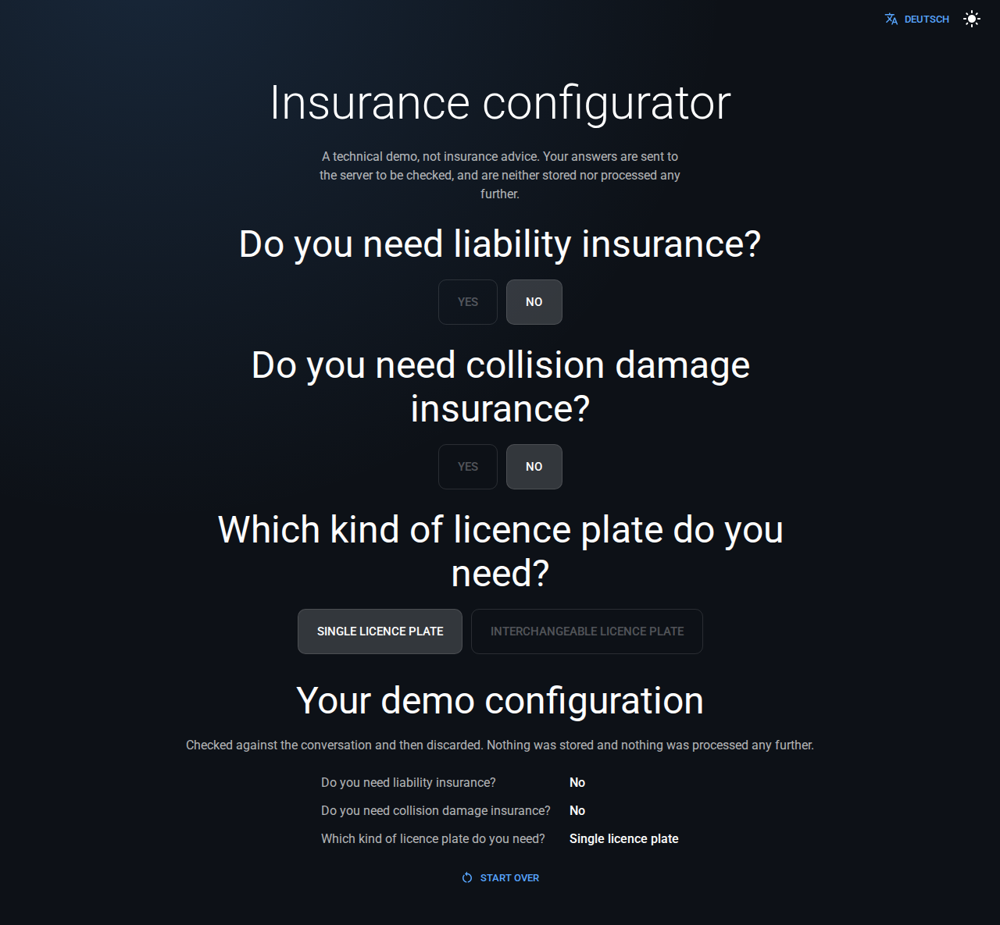

# Insurance configurator

<sub>Versicherungs-Konfigurator</sub>

Answer a short series of questions. The server then checks that your answers
really are a reachable path through its decision tree, and reads the resulting
configuration back to you. In English or German, whichever your browser asks
for.

**A technical demo, not an insurance product.** It gives no advice and stores
nothing. Ground-up modern rebuild of a 2022 coding challenge of mine, built as a
portfolio piece.

### [→ Try it live](https://insurance-configurator-demo.vercel.app/)

[](https://insurance-configurator-demo.vercel.app/)
[](https://github.com/SetupCoding/insurance-configurator-demo/actions/workflows/ci.yml)

| Start                                                                                    | Mid-conversation                                                                                         | Result                                                                                       |
| ---------------------------------------------------------------------------------------- | -------------------------------------------------------------------------------------------------------- | -------------------------------------------------------------------------------------------- |
|  |  |  |

<sub>Those are the Chromium visual-regression baselines, referenced where they live rather than copied, so they cannot drift out of date. Every one of them exists in German too (`-de-`), because the two languages wrap differently.</sub>

## Run it

Needs Node 24 and pnpm 10 (see `engines`, `.nvmrc` and `packageManager` in
`package.json`).

```bash
pnpm install     # also activates the Husky git hooks
pnpm dev         # http://localhost:3000
```

That single command is the whole app. `pnpm dev` also serves the API route the
final "Submit" posts to, so there is no separate backend to start.

Or as the production image, a multi-stage build of the Next.js standalone
server:

```bash
docker compose up --build    # http://localhost:3000
```

## What it does

- **It is a decision tree.** Each question narrows things down until the flow
  ends.
- **Nothing submits automatically.** An explicit "Submit" click sends the
  answers.
- **Earlier answers stay editable** until that click. Changing one drops
  everything after it and replays; re-clicking an answer you already gave
  decides nothing new, so the questions it led to survive.
- **"Start over" asks first** (a native `<dialog>`), and aborts an in-flight
  submission rather than letting the response land in a conversation you have
  already restarted.
- **Progress survives a refresh** (`sessionStorage`, expiring after 24 hours)
  but is dropped once a submission is accepted, so a reload starts a fresh
  conversation instead of offering to submit a finished one again.
- **Dark by default**, with a toggle that eases the change rather than swapping
  it abruptly.
- **English and German**, questions included. A bare `/` serves whichever your
  browser asks for and falls back to English, an explicit `/de` or `/en` always
  wins over that, and the header carries a link to the other one.

### Accessibility

- A skip link jumps keyboard users straight past the header to the conversation.
- Focus moves to the next question's first option as it appears, not to a
  heading, so they land on something actionable.
- Every interactive control gets the same visible focus ring.
- Checked against axe for WCAG 2.0/2.1 A and AA violations in both colour
  schemes, including under Windows forced-colors mode.

## What the server actually checks

`POST /api/conversation` does not just check that the payload is well formed. It
replays the answers through the flow graph, because for any set of choices
exactly one ordered sequence of answers is reachable.

| Rejected                                                                                                                                   | Status |
| ------------------------------------------------------------------------------------------------------------------------------------------ | ------ |
| Unknown question, repeated answer, wrong order, incomplete path, a value that was never offered, answers appended past the end of the flow | `422`  |
| `?locale=` names a language the app does not ship                                                                                          | `422`  |
| Body is not JSON                                                                                                                           | `400`  |
| Body larger than 16 KB                                                                                                                     | `413`  |

What comes back is derived from that walk, which is why the result on screen is
the server's wording rather than the client's copy of it.

That wording is also why the request carries `?locale=`. The failure codes above
are language-neutral and the UI owns their phrasing, but `question` and `label`
in an accepted response are display text, and the server resolves them from the
flow data in the locale it was asked for. Leave the parameter off and it answers
in English, the default.
[ADR 0012](docs/adr/0012-localised-flow-data-and-a-locale-on-the-wire.md) is
precise about which half of the contract is neutral and which is not.

The flow definition itself is validated the same way, at import time:

- Unique step ids and names
- Option values matching the step's declared `valueType`
- Unique option values, and unique option texts within a step per locale
- Every `nextId` resolving to a real step
- Every step reachable from the first
- No cycles
- A translation for every locale, for every question and every option

Reachability and acyclicity are the load-bearing pair. Acyclicity plus
resolvable references is what guarantees every conversation terminates: a walk
can never revisit a step, so it must eventually reach an option that ends the
flow.

**Nothing is stored.** That makes the operation idempotent, which is why there is
no idempotency key and no request deduplication: there is no duplicate effect to
prevent. It is not why there is no rate limiter. Statelessness defends against
duplicate effects; a limiter defends against resource consumption, which is a
different problem that being reachable creates on its own. The limiter is
therefore missing rather than unnecessary, and
[ADR 0009](docs/adr/0009-a-stateless-demo-that-really-validates.md) says so in
those words, along with what adding one honestly would cost.

## Architecture

```
messages/                 UI copy, one catalogue per locale
src/
  proxy.ts                Locale routing and the per-request CSP nonce
  app/
    [locale]/             App Router pages, under a locale segment
    api/conversation/     POST validates a submitted path and echoes it back
  features/
    flow/                 The conversation state machine (pure reducer),
                          persistence, submission, the client component
    i18n/                 The locale switcher
  i18n/                   next-intl per-request config
  lib/
    schema/               Zod schemas, the single source of truth for types
    domain/               Rules that need the flow, not just a shape
    data/                 The bundled, validated flow fixture
    i18n/                 Locale list and Accept-Language negotiation
    security/             The CSP and its nonce
    api/                  Client-side fetch wrapper
    mocks/                MSW handlers, shared by tests
  components/             Presentational UI (question, result, error states)
  theme/                  MUI theme and App Router SSR wiring
```

- `page.tsx` is a Server Component that loads and validates the flow at render
  time, so the first paint already has the opening question.
- Exactly one `'use client'` boundary (`InsuranceChat`) owns everything
  interactive below it.
- The flow is a plain `useReducer` state machine, and ships bundled with the
  app. There is no API call to fetch it.

## Decisions

Each one is a short ADR in [docs/adr/](docs/adr/).

| #                                                                     | Decision                                                            |
| --------------------------------------------------------------------- | ------------------------------------------------------------------- |
| [0001](docs/adr/0001-app-router-and-server-component-page.md)         | App Router with a Server Component page                             |
| [0002](docs/adr/0002-flow-as-a-reducer-state-machine.md)              | The conversation as a pure reducer state machine                    |
| [0003](docs/adr/0003-zod-as-single-source-of-truth.md)                | Zod schemas as the single source of truth for domain types          |
| [0004](docs/adr/0004-tanstack-query-and-msw-over-orval.md)            | TanStack Query and MSW over a generated client (superseded by 0010) |
| [0005](docs/adr/0005-self-hosted-fonts.md)                            | Self-hosted fonts, not `next/font/google`                           |
| [0006](docs/adr/0006-hoisted-node-linker-for-standalone-output.md)    | `node-linker=hoisted` for Next.js standalone output                 |
| [0007](docs/adr/0007-visual-tests-outside-the-ci-gate.md)             | Visual regression tests outside the CI gate                         |
| [0008](docs/adr/0008-manual-colour-scheme-over-media-query.md)        | Manual colour scheme switching, not just `prefers-color-scheme`     |
| [0009](docs/adr/0009-a-stateless-demo-that-really-validates.md)       | A stateless demo whose server does real work                        |
| [0010](docs/adr/0010-fetch-plus-a-local-submission-hook.md)           | Fetch plus a local submission hook, not a mutation library          |
| [0011](docs/adr/0011-nonce-based-csp-in-the-proxy.md)                 | A nonce-based Content-Security-Policy, in the proxy                 |
| [0012](docs/adr/0012-localised-flow-data-and-a-locale-on-the-wire.md) | Localised flow data, and a locale on the wire                       |

The Content-Security-Policy is nonce-based and lives in `src/proxy.ts`: no
`unsafe-inline`, no `unsafe-eval`, and no exception for style attributes either.
What it costs is the page being prerendered, which
[ADR 0011](docs/adr/0011-nonce-based-csp-in-the-proxy.md) works through.

## Scripts

| Script                              | Purpose                                                         |
| ----------------------------------- | --------------------------------------------------------------- |
| `pnpm dev`                          | Start the dev server                                            |
| `pnpm build`                        | Production build                                                |
| `pnpm start`                        | Run the production build                                        |
| `pnpm lint` / `pnpm lint:fix`       | ESLint                                                          |
| `pnpm format` / `pnpm format:check` | Prettier                                                        |
| `pnpm typecheck`                    | Next route types, then `tsc --noEmit`                           |
| `pnpm test` / `pnpm test:watch`     | Unit tests (Vitest and Testing Library)                         |
| `pnpm test:coverage`                | Unit tests with coverage, and the coverage gates                |
| `pnpm test:e2e`                     | Cross-browser flow, i18n, security and a11y tests, no `@visual` |
| `pnpm test:visual`                  | Visual regression snapshots                                     |

Before opening a PR, `pnpm lint && pnpm typecheck && pnpm test:coverage && pnpm build`
should pass. CI runs the same plus `test:e2e`. Commits follow
[Conventional Commits](https://www.conventionalcommits.org/) and are checked by
commitlint; a pre-commit hook runs ESLint and Prettier on staged files.

## Testing

```bash
pnpm test:coverage                     # unit tests, gated
pnpm exec playwright install           # once, to fetch browser binaries
pnpm test:e2e                          # flow, i18n, CSP, headers, a11y, 3 browsers
```

Coverage has a floor rather than just a number. The flow validator, the
submission validator and the reducer are held to full statement, line and
function cover, because a silent regression there is the one that would matter.

Visual snapshots are not part of the gate, and cannot be regenerated on Windows
or macOS. Run the `Visual regression` workflow with `update_snapshots` and commit
the `visual-baselines` artifact. See
[ADR 0007](docs/adr/0007-visual-tests-outside-the-ci-gate.md).

## CI/CD

| Job                       | What it does                                                                                               |
| ------------------------- | ---------------------------------------------------------------------------------------------------------- |
| Lint, types, unit & build | Production dependency audit, Prettier, ESLint, typecheck, unit tests with coverage gates, production build |
| End-to-end                | Flow, locale routing, CSP, security header and accessibility tests across Chromium, Firefox and WebKit     |
| Container image           | Builds the image, waits for its own healthcheck, then posts valid, tampered and localised requests at it   |
| Visual regression         | On demand only, in a digest-pinned Playwright container                                                    |

The container job exists because the other jobs run against a dev server and
never touch the standalone bundle the image ships. Every action is pinned to a
commit SHA and both container images to a digest, so a moved tag cannot change
what runs. Dependabot keeps npm, Actions and Docker dependencies current.

## Deploy

Live on [Vercel](https://vercel.com) at
[insurance-configurator-demo.vercel.app](https://insurance-configurator-demo.vercel.app/).
`vercel.json` declares the framework, so importing the repository needed no
build configuration and no environment variables. Every push to `main` deploys
to production, and every pull request gets a preview URL.

Security headers come from `next.config.ts` rather than platform configuration,
so they apply to the Docker image too, and the Content-Security-Policy comes
from `src/proxy.ts` because it needs a fresh nonce per request. Standalone output
is switched off on Vercel, which builds its own output and fails while packaging
that one; `next.config.ts` explains it.

## Provenance

This repository modernises a coding challenge I wrote in 2022. Claude Code did
the modernisation in a compound-engineering workflow, and Codex agents reviewed
the result adversarially afterwards. The agents contributed analysis,
implementation drafts, tests and documentation review. Product decisions, reading
the diffs, judging the test output and final acceptance are mine.

The early commit sequence was tidied up after the fact for presentation, so it
does not reflect the organic order the work happened in. Nothing is backdated,
and from this commit on the history is left alone: no amend, no squash, no
force-push.

## License

[MIT](LICENSE) © Anton "Setup" Schmidt
