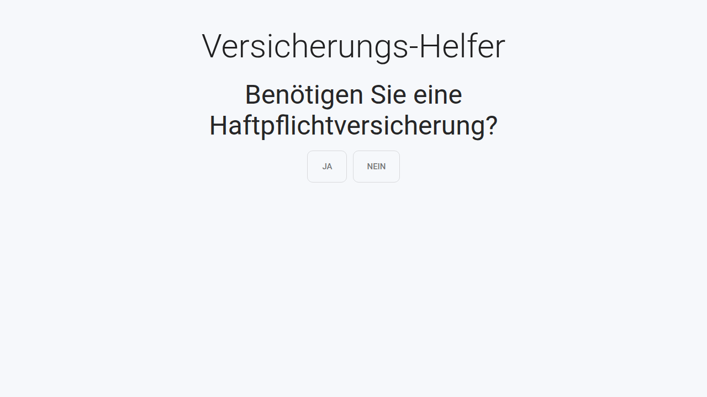
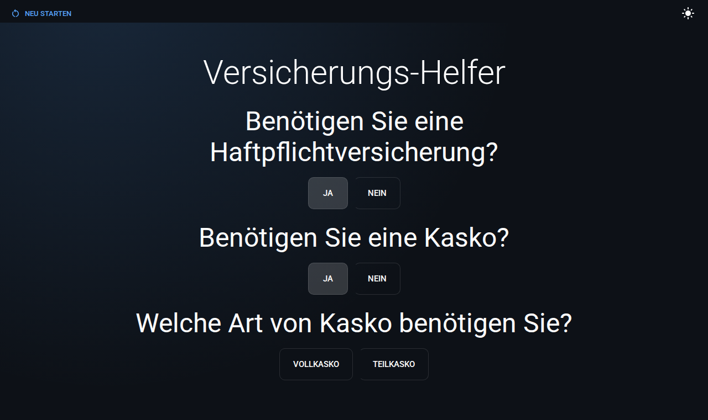
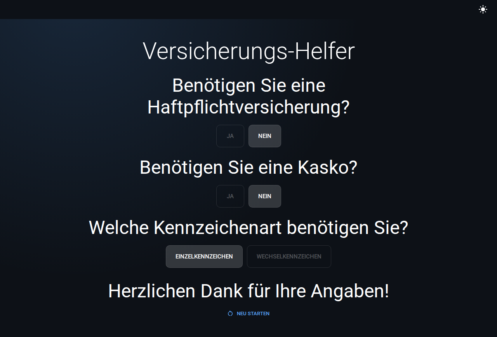

# Versicherungs-Helfer

A small, well-tested insurance-advisor chatbot: answer a short series of
questions and it narrows down which type of insurance fits your situation.
Ground-up modern rebuild of a 2022 "coding challenge", built as a portfolio
piece to present modern tooling.

[](https://github.com/SetupCoding/chat-bot-anton-schmidt/actions/workflows/ci.yml)
[](https://chat-bot-anton-schmidt.vercel.app)

## Screenshots

| Start                                                               | Mid-conversation                                                                    | Completed                                                          |
| ------------------------------------------------------------------- | ----------------------------------------------------------------------------------- | ------------------------------------------------------------------ |
|  |  |  |

## What it does

The conversation is a decision tree: each question narrows things down until
you reach the end, then an explicit "Absenden" button sends the answers
(nothing submits automatically, and earlier answers stay editable right up
until it's clicked). You can go back and change an earlier answer;
everything after that point gets dropped and replayed, or start over
completely with the "Neu starten" button, which asks for confirmation (a
native `<dialog>`) before actually discarding anything. It lives in a small
header that scrolls with the page rather than floating fixed in a corner, so
it can never overlap the conversation on narrow viewports; once you've
submitted, it moves to sit right below the thank-you message. Progress
survives a page refresh (it's kept in `sessionStorage`). The theme toggle in
that same header switches between a dark theme (the default) and a light
one, with the change eased rather than an abrupt swap.

A skip link lets keyboard users jump straight past the toggle to the
conversation, focus moves to the next question's first option as it appears
(not a heading, so keyboard users land on something actionable), and every
interactive control gets the same visible focus ring. The whole thing has
been checked against axe for WCAG 2.0/2.1 A/AA violations in both colour
schemes, including under Windows forced-colors (high-contrast) mode.

Every piece of data, the bundled flow fixture and the payload sent to
`/api/conversation`, is validated at runtime with the same [Zod](https://zod.dev/)
schemas the TypeScript types are inferred from, so there's no separate DTO
layer that can drift out of sync.

## Architecture

```
src/
  app/                    App Router pages and API routes (Server Components)
    api/flow/              GET  serves the validated flow
    api/conversation/       POST validates and accepts a submission
  features/flow/          The conversation state machine (pure reducer),
                           persistence, and the client component that owns it
  lib/
    schema/                Zod schemas, the single source of truth for types
    data/                  The bundled, validated flow fixture
    api/                    Client-side fetch wrapper
    mocks/                 MSW handlers, shared by tests
  components/             Presentational UI (question, loading, error states)
  theme/                  MUI theme and App Router SSR wiring
```

`page.tsx` is a Server Component that loads and validates the flow at render
time; a single `'use client'` component (`InsuranceChat`) owns everything
interactive below it. The flow itself is a plain `useReducer` state machine:
selecting an option advances it, a terminal option completes it, and
revising an earlier answer truncates the steps after it. There's no external
API call for the flow definition either; it ships bundled with the app.

The reasoning behind these choices, and a few others (why TanStack Query and
MSW over a generated client, why fonts are self-hosted, why visual tests run
outside the CI gate, why the colour scheme is manually switched rather than
following `prefers-color-scheme` alone), is written up in [docs/adr/](docs/adr/).

## Getting started

Requires Node 22 and pnpm 10 (see `.nvmrc` and `packageManager` in
`package.json`).

```bash
pnpm install     # also activates the Husky git hooks
pnpm dev         # http://localhost:3000
```

That single command is the whole app: answering questions runs entirely in
the browser, and `pnpm dev` also serves the API routes the final "Absenden"
submits to, so there's no separate backend to start.

## Scripts

| Script                              | Purpose                                                                     |
| ----------------------------------- | --------------------------------------------------------------------------- |
| `pnpm dev`                          | Start the dev server                                                        |
| `pnpm build`                        | Production build                                                            |
| `pnpm start`                        | Run the production build                                                    |
| `pnpm lint` / `pnpm lint:fix`       | ESLint                                                                      |
| `pnpm format` / `pnpm format:check` | Prettier                                                                    |
| `pnpm typecheck`                    | `tsc --noEmit`                                                              |
| `pnpm test` / `pnpm test:watch`     | Unit tests (Vitest + Testing Library)                                       |
| `pnpm test:coverage`                | Unit tests with coverage                                                    |
| `pnpm test:e2e`                     | Cross-browser flow and accessibility tests (Playwright), excludes `@visual` |
| `pnpm test:visual`                  | Visual regression snapshots                                                 |

Before opening a PR, `pnpm lint && pnpm typecheck && pnpm test:coverage && pnpm build`
should all pass; CI runs the same checks plus `test:e2e`. Commits follow
[Conventional Commits](https://www.conventionalcommits.org/) and are checked
by commitlint on commit; a pre-commit hook runs ESLint and Prettier on staged
files.

## Testing

```bash
pnpm test:coverage                     # unit tests, ~93% line coverage
pnpm exec playwright install           # once, to fetch browser binaries
pnpm test:e2e                          # flow and accessibility, 3 browsers
pnpm test:visual                       # pixel snapshots, see docs/adr/0007
```

## Docker

```bash
docker compose up --build              # http://localhost:3000
```

The image is a multi-stage build producing a Next.js standalone server, see
[Dockerfile](Dockerfile) and [docs/adr/0006](docs/adr/0006-hoisted-node-linker-for-standalone-output.md)
for why `.npmrc` pins `node-linker=hoisted`.

## CI/CD

GitHub Actions ([.github/workflows/ci.yml](.github/workflows/ci.yml)) runs
Prettier, ESLint, typecheck, unit tests with coverage, the production build,
and cross-browser e2e/accessibility tests on every push and PR to `main`.
Visual regression runs separately, on demand, in a pinned Playwright
container (see [docs/adr/0007](docs/adr/0007-visual-tests-outside-the-ci-gate.md)).
Dependabot keeps npm and Actions dependencies current.

## Deploy

Deployed on [Vercel](https://vercel.com); the framework is auto-detected via
`vercel.json`. Every push to `main` deploys to production, and every PR gets
a preview URL.

## License

[MIT](LICENSE) © Anton "Setup" Schmidt
